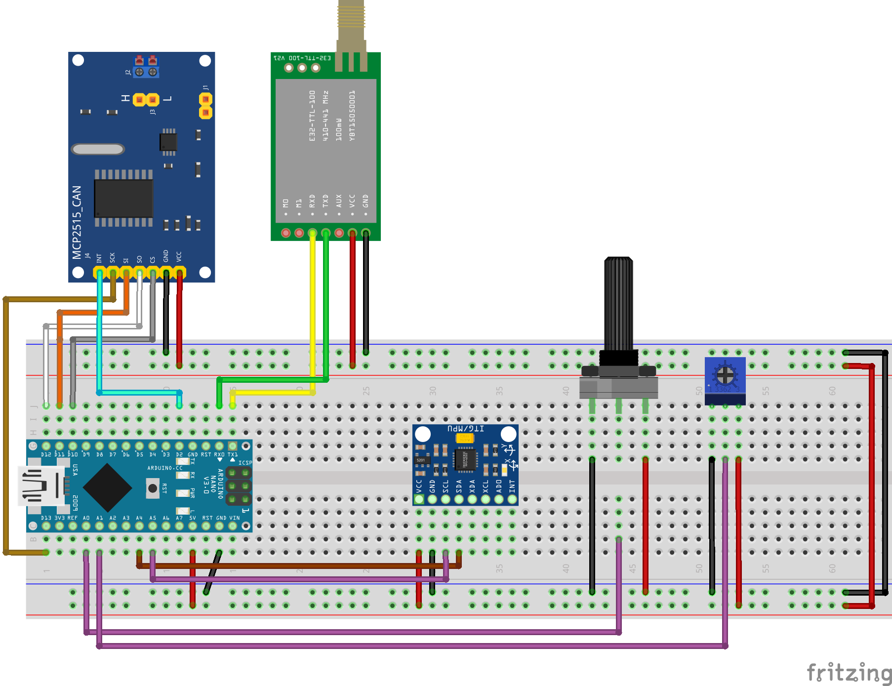

  
  <h1>Projeto Trainee de Eletrica PS 2024.1</h1>
  
  <h2>
    Sistema de Telemetria e APPS 
  </h2>

 

<!-- Table of Contents -->
# :notebook_with_decorative_cover: Lista de conteudos

- [Sobre o Projeto](#star2-sobre-o-projeto)
  * [Esquema eletrico](#camera-esquema-eletrico)
  * [Referencia por cores](#art-color-reference)
  * [Variaveis de ambiente](#variaveis-de-ambiente)
- [Getting Started](#toolbox-getting-started)
  * [Pre requisitos](#bangbang-pre-requisitos)
- [Roadmap](#compass-roadmap)

  

<!-- About the Project -->
## :star2: Sobre o projeto

<!-- Screenshots -->
### :camera: Esquema eletrico

 

  

<!-- Color Reference -->
### :art: Color Reference

| Color             | Hex                                                                |
| ----------------- | ------------------------------------------------------------------ |
| Negativo (GND) |  #000000 |
| Positivo (VCC) |  #FF0000 |
...

<!-- Getting Started -->
## 	:toolbox: Getting Started

<!-- Prerequisites -->
### :bangbang: Pre requisitos

Para que você consiga compilar este código corretamente instale os seguintes programas

 - [Visual Studio Code]('https://code.visualstudio.com/')
 - [PlatformIo]('https://platformio.org/')

<!-- Roadmap -->
## :compass: Roadmap

* [x] Código APPS
* [ ] Código Rede CAN
* [ ] Código Giroscópio e acelerometro
* [ ] Código LoRA
* [ ] Código GPS
