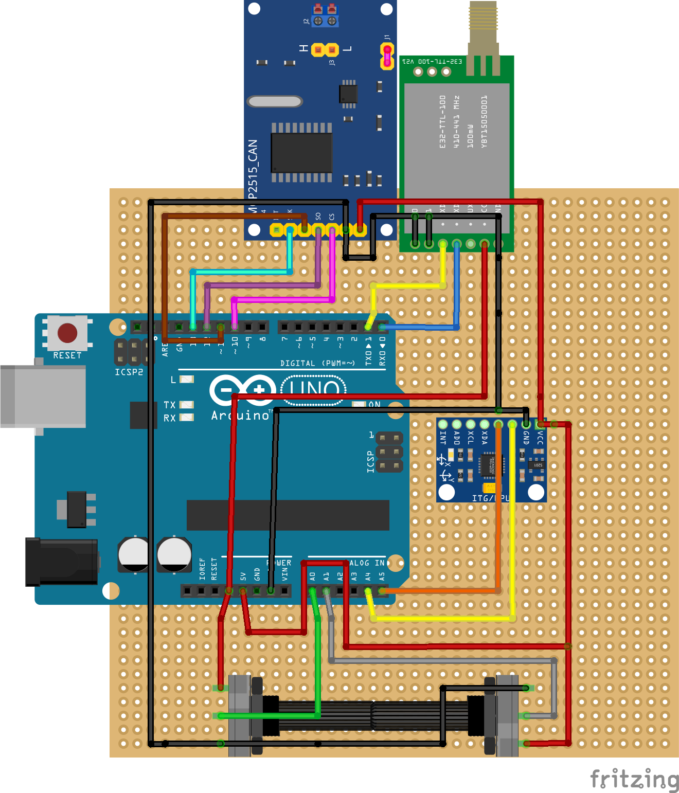

  
  <h1>Projeto Trainee de Eletrica PS 2024.1</h1>
  
  <h2>
    Sistema de Telemetria e APPS 
  </h2>

 

<!-- Table of Contents -->
# :notebook_with_decorative_cover: Lista de conteudos

- [Sobre o Projeto](#star2-sobre-o-projeto)
  * [Esquema eletrico](#camera-esquema-eletrico)
  * [Referencia por cores](#art-color-reference)
  * [Variaveis de ambiente](#variaveis-de-ambiente)
- [Getting Started](#toolbox-getting-started)
  * [Pre requisitos](#bangbang-pre-requisitos)
- [Roadmap](#compass-roadmap)

  

<!-- About the Project -->
## :star2: Sobre o projeto

<!-- Screenshots -->
### :camera: Esquema eletrico

 

  

<!-- Color Reference -->
### :art: Color Reference

| Color             | Hex                                                                |Arduino Uno|
| ----------------- | ------------------------------------------------------------------ |-----------------|
| Negativo (GND) |  #000000 | GND |
| Positivo (VCC) |  #FF0000 | VCC (Lora 3v3)|
| Sinal POT 1 (5-0v) |  #7aff33 | A0 |
| Sinal POT 2 (0-5v) |  #cdcdcd | A1 |
| SCL Gyro |  #ffc32d | A5 (SCL) |
| SDA Gyro |  #b68302 | A4 (SDA)|
| RX LoRA |  #fffb00 | D0 (TX0) |
| TX LoRA |  #00b2ff | D1 (TX1) |
| CAN CS |  #cd00ff | D10 (SS)|
| CAN SO |  #63007c | D12 (CIPO)|
| CAN SI |  #7c0200 | D11 (COPI)|
| CAN SCK |  #62f5ff | D13 (SCK) |

<!-- Getting Started -->
## 	:toolbox: Getting Started

<!-- Prerequisites -->
### :bangbang: Pre requisitos

Para que você consiga compilar este código corretamente instale os seguintes programas

 - [Visual Studio Code]('https://code.visualstudio.com/')
 - [PlatformIo]('https://platformio.org/')

<!-- Roadmap -->
## :compass: Roadmap

* [x] Código APPS
* [ ] Código Rede CAN
* [ ] Código Giroscópio e acelerometro
* [ ] Código LoRA
* [ ] Código GPS
